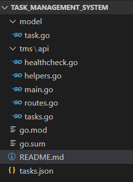

## Project Setup

Create a directory ``task_management_system`` . This will be the HOME directory of the project.

Next, ``cd`` into this directory and run 

~~~go 
go mod init tms.zinkworks.com
~~~

The above command will enable modules for the project. The ``go mod init`` command expects a ``module path``, which is a unique identifier for the project. We will use ``tms.zinkworks.com`` as our module path.

You will se a ``go.mod`` file has been created and it look similar to this:

~~~go
module tms.zinkworks.com

go 1.20
~~~

### Managing Dependencies with ``go.mod`` in Go Projects

1. If a valid ``go.mod`` file is present at the root of your project directory, your project is recognized as a module.
2. When you're working within your project directory and use ``go get`` to download a dependency, the specific version of the dependency will be recorded in the go.mod file.
3. This approach ensures reproducible builds across various machines and environments because the exact versions are known and managed in the go.mod file.
4. When you run or build the code in your project, Go will utilize the precise dependencies listed in the go.mod file. In case the required dependencies are not already present on your local machine, Go will automatically download them along with any recursive dependencies.
5. Additionally, the go.mod file defines the module path (e.g., tms.zinkworks.com in our case), which acts as the root import path for the packages within your project.

### Directory Structure for the Project

Go to home directory and create two more directory inside it.

``model`` - this will contain all the models

``tms\api`` - this will contain all the APIs

At this point you will see below directory structure along will few additional files that will be explained later.

### Setting a HTTP Server

See ``main.go`` file

### Integrating ``httprouter`` package

When developing a Go API with endpoints, you may encounter limitations in the standard ``http.ServeMux`` router. This default router lacks features such as routing requests to different handlers based on request methods (e.g., GET, POST) and handling clean URLs with interpolated parameters.

To overcome these limitations, we'll integrate the popular ``httprouter`` package into our application. ``httprouter`` is a well-tested and stable router that meets our requirements. Moreover, it offers excellent performance due to its use of a radix tree for URL matching. If you plan to build a REST API for public use, ``httprouter`` is a reliable choice.

#### Comparing httprouter with Java EE and Spring for Building Go APIs

**Familiarity with Servlet-like Routing:** Developers familiar with Java EE or Spring are accustomed to working with powerful routing mechanisms for handling different HTTP methods and clean URLs with interpolated parameters. httprouter provides similar functionality, making it easy for them to adapt and work with in a Go environment.

**Enhanced Functionality:** While the Go standard library's http.ServeMux has certain limitations, httprouter overcomes these limitations by offering more advanced features like routing requests based on HTTP methods (GET, POST, etc.) and supporting clean URLs with interpolated parameters. This allows developers to build more sophisticated APIs and handle various types of requests efficiently.

We will use ``go get`` command for downloading the latest release of httprouter package.

~~~go
go get github.com/julienschmidt/httprouter@v1
~~~

This will also update the ``go.mod`` file and add the ``httprouter`` dependency.

~~~go
module tms.zinkworks.com

go 1.20

require github.com/julienschmidt/httprouter v1.3.0
~~~

### Defining the ``Task`` Model

See ``task.go`` file

### Defining the Routes

See ``routes.go`` file

## Running the Project

~~~go
go run .\tms\api
~~~

## Endpoints

### Fetching Task By Id
~~~
curl localhost:4000/tasks/2
~~~

### Get All Tasks
~~~
curl -X POST localhost:4000/tasks
~~~

